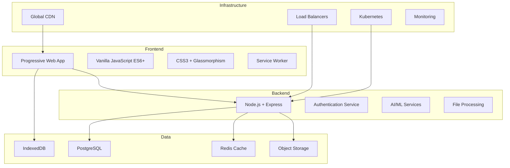
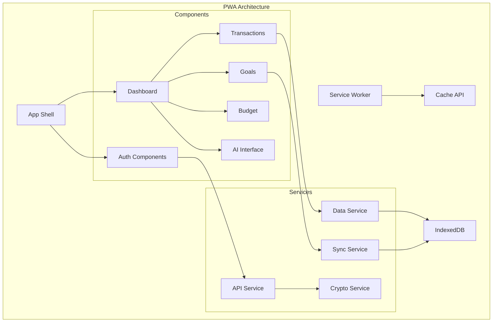
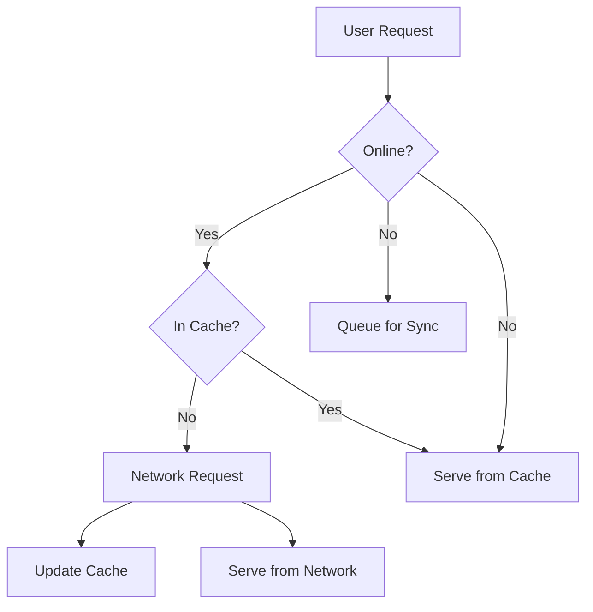

# 🏗️ SmartFinanceAI System Architecture

*Comprehensive technical architecture documentation for the global personal finance platform*

---

## 📋 Table of Contents

- [Overview](#overview)
- [High-Level Architecture](#high-level-architecture)
- [Frontend Architecture](#frontend-architecture)
- [Backend Architecture](#backend-architecture)
- [Database Design](#database-design)
- [Security Architecture](#security-architecture)
- [AI/ML Infrastructure](#aiml-infrastructure)
- [Global Infrastructure](#global-infrastructure)
- [Performance & Scalability](#performance--scalability)
- [Deployment Architecture](#deployment-architecture)
- [Monitoring & Observability](#monitoring--observability)
- [Data Flow](#data-flow)
- [Integration Patterns](#integration-patterns)

---

## 🌐 Overview

SmartFinanceAI is built as a **Global SaaS Platform** designed for massive scale, security, and performance. The architecture follows microservices patterns with a PWA frontend, enabling seamless user experiences across 50+ countries.

### Core Principles

- **🔒 Security First**: Bank-level encryption and zero-knowledge architecture
- **🌍 Global Scale**: Multi-region deployment with local compliance
- **⚡ Performance**: Sub-2-second load times worldwide
- **🔄 Resilience**: 99.9% uptime with automated failover
- **📱 Mobile First**: PWA with offline-first capabilities
- **🤖 AI Native**: Machine learning integrated throughout the platform

### Technology Stack



---

## 🏛️ High-Level Architecture

### System Overview

```mermaid
architecture-beta
    group api(logos:aws-api-gateway)[API Gateway]
    
    service web(logos:pwa)[PWA Frontend] in api
    service auth(logos:auth0)[Auth Service] in api
    service core(logos:nodejs)[Core API] in api
    service ai(logos:tensorflow)[AI Service] in api
    service file(logos:aws-s3)[File Service] in api
    
    group data(logos:database)[Data Layer]
    
    service cache(logos:redis)[Redis Cache] in data
    service db(logos:postgresql)[PostgreSQL] in data
    service search(logos:elasticsearch)[Search Engine] in data
    service queue(logos:rabbitmq)[Message Queue] in data
    
    group external(cloud)[External Services]
    
    service banks(logos:bank)[Banking APIs] in external
    service openai(logos:openai)[OpenAI] in external
    service exchange(logos:currency)[Exchange Rates] in external
    
    web:R --> L:core
    web:R --> L:auth
    web:R --> L:ai
    web:R --> L:file
    
    core:R --> L:cache
    core:R --> L:db
    core:R --> L:queue
    
    ai:R --> L:openai
    core:R --> L:banks
    core:R --> L:exchange
```



### Component Responsibilities

| Component | Responsibility | Technology |
|-----------|----------------|------------|
| **PWA Frontend** | User interface, offline functionality | Vanilla JS, CSS3, Service Worker |
| **API Gateway** | Request routing, rate limiting, authentication | Express.js, JWT |
| **Core API** | Business logic, data management | Node.js, PostgreSQL |
| **Auth Service** | User authentication, authorization | JWT, WebAuthn, OAuth |
| **AI Service** | Machine learning, insights generation | TensorFlow.js, OpenAI |
| **File Service** | CSV processing, document management | Node.js, AWS S3 |
| **Cache Layer** | Performance optimization | Redis, CDN |
| **Database** | Persistent data storage | PostgreSQL with replication |

---

## 🎨 Frontend Architecture

### Progressive Web App (PWA) Design



### Module System

```javascript
// Core module structure
src/
├── core/               // Core application logic
│   ├── app.js         // Main application controller
│   ├── router.js      // Client-side routing
│   └── state.js       // Application state management
├── components/        // Reusable UI components
│   ├── forms/         // Form components
│   ├── charts/        // Data visualization
│   └── modals/        // Modal dialogs
├── services/          // Business logic services
│   ├── api.js         // API communication
│   ├── storage.js     // Local storage management
│   └── crypto.js      // Encryption/decryption
└── utils/             // Utility functions
    ├── formatters.js  // Data formatting
    └── validators.js  // Input validation
```

### Component Architecture

```javascript
// Component base class
class BaseComponent {
  constructor(element, options = {}) {
    this.element = element;
    this.options = { ...this.defaultOptions, ...options };
    this.state = {};
    this.init();
  }

  init() {
    this.bindEvents();
    this.render();
  }

  setState(newState) {
    this.state = { ...this.state, ...newState };
    this.render();
  }

  render() {
    // Override in subclasses
  }

  bindEvents() {
    // Override in subclasses
  }

  destroy() {
    // Cleanup event listeners and references
  }
}
```

### Offline-First Strategy



---

## ⚙️ Backend Architecture

### Microservices Design

```mermaid
graph TB
    subgraph "API Gateway Layer"
        GATEWAY[API Gateway]
        AUTH_MW[Auth Middleware]
        RATE_MW[Rate Limiting]
        LOG_MW[Logging Middleware]
    end
    
    subgraph "Core Services"
        USER_SVC[User Service]
        ACCOUNT_SVC[Account Service]
        TRANSACTION_SVC[Transaction Service]
        GOAL_SVC[Goal Service]
        BUDGET_SVC[Budget Service]
    end
    
    subgraph "AI Services"
        HEALTH_